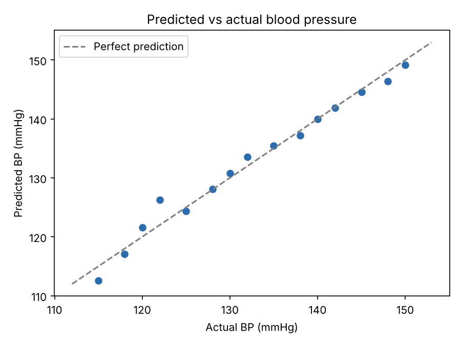
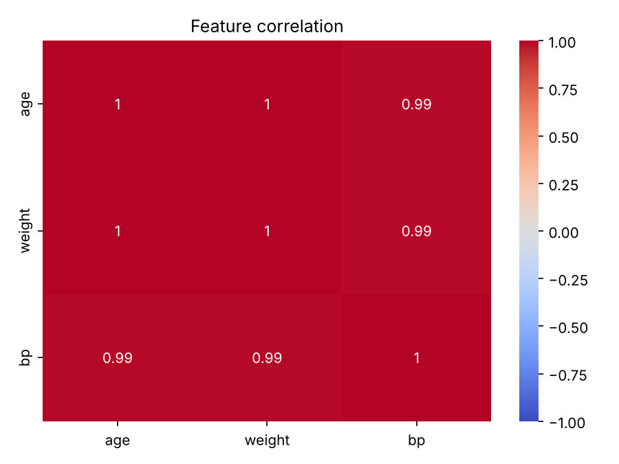

# Blood Pressure Prediction Model

A beginner machine learning project that predicts **systolic blood pressure (mmHg)** from a person's **age** and **weight** using linear regression in scikit-learn.

> **Note:** This is a learning project. It uses a small, hand-made sample of 15 records, so the scores below show the workflow working, not a model ready for real-world or medical use.

## Why

Hypertension often goes undetected in its early stages, especially where regular check-ups are hard to access. This project explores how far simple, easy-to-collect measurements can go in estimating blood pressure.

## How it works

1. Loads a small dataset of age, weight and blood pressure with pandas
2. Splits it into training (80%) and test (20%) sets
3. Scales the features and fits a **linear regression** model, using a scikit-learn pipeline so scaling is learned from training data only
4. Evaluates on the test set and with 5-fold cross-validation
5. Saves a correlation heatmap and a predicted-vs-actual chart

## Results

| Metric | Value |
|---|---|
| R² (test set) | 0.981 |
| Mean absolute error (test set) | 0.81 mmHg |
| RMSE (test set) | 1.02 mmHg |
| Mean absolute error (5-fold CV) | 1.53 mmHg |

Example: age 50, weight 70 kg → predicted **126.6 mmHg**





## Run it

```bash
pip install -r requirements.txt
python bp_model.py
```

Running it also saves the two charts as PNG files.

## Limitations

- Only 15 synthetic records, so the high scores mostly reflect how clean the sample is
- Age and weight are strongly correlated with each other, which makes their separate effects hard to tell apart
- Real blood pressure depends on many more factors (sex, height, activity, diet, medication, genetics)

## Next steps

- Train on a real public dataset (e.g. a Kaggle cardiovascular dataset)
- Add more features and compare models (random forest, gradient boosting)
- Build a small web app (Streamlit) for trying predictions

## Tech

Python · pandas · NumPy · scikit-learn · matplotlib · seaborn
