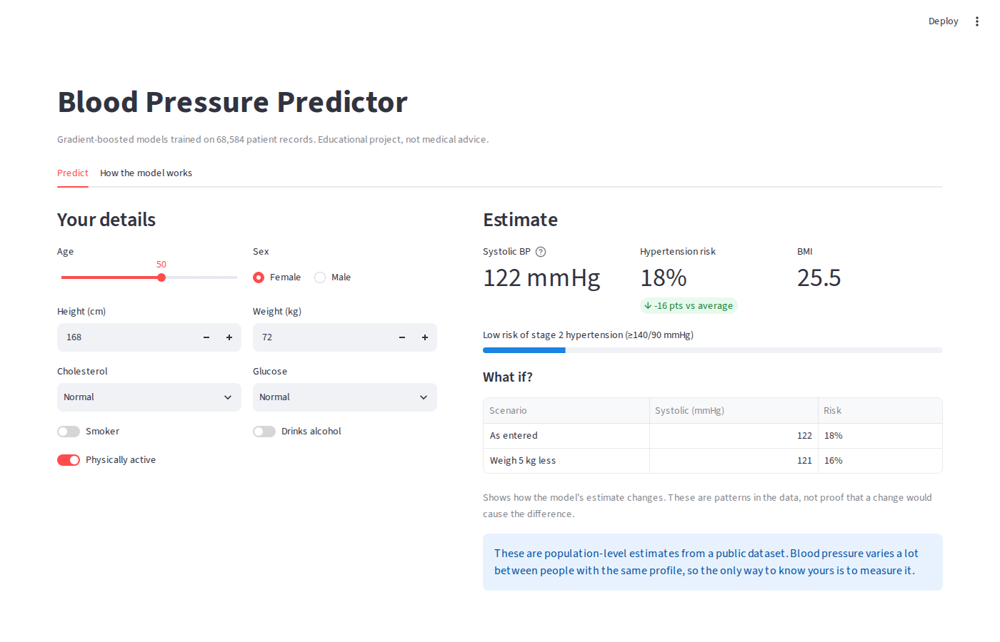
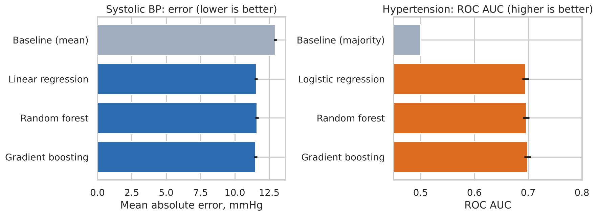
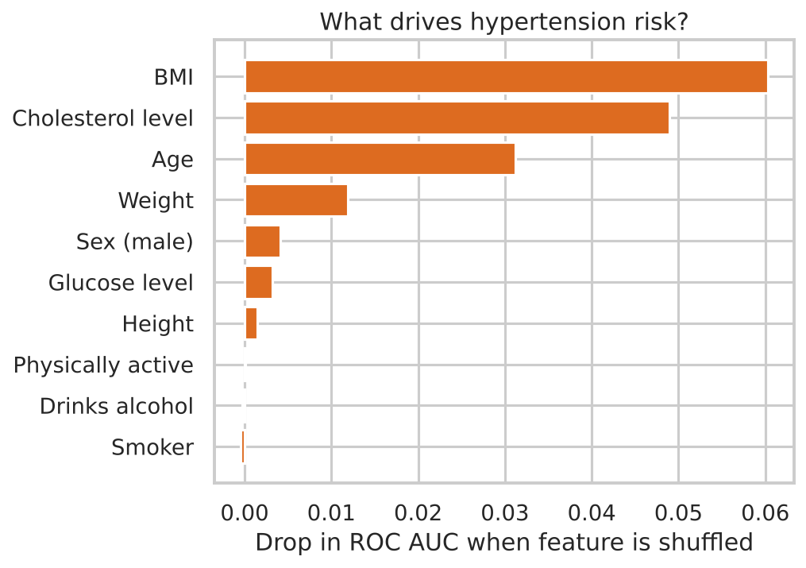
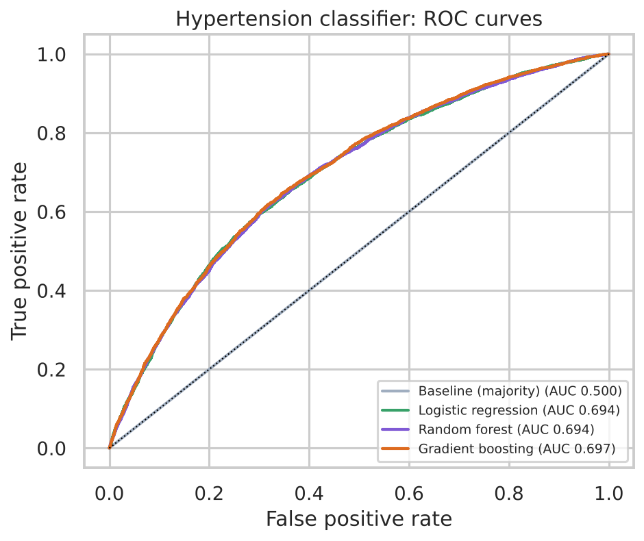
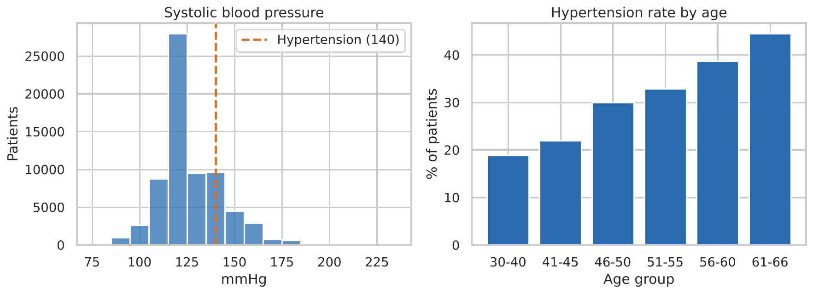

# 🩺 Blood Pressure Prediction

[](https://github.com/aditeayahh/Blood-Pressure-Prediction-Model/actions/workflows/tests.yml)


An end-to-end machine learning project that estimates **systolic blood pressure** and the **risk of stage 2 hypertension** (≥140/90 mmHg) from everyday health information, trained on **68,584 real patient records**, with an interactive web app.



## Why

Hypertension affects over a billion people and often has no symptoms until it causes a heart attack or stroke. Many people go years without a reading. This project asks: **how much can simple information (age, height, weight, cholesterol, lifestyle) tell us about someone's blood pressure risk?**

## Highlights

- **Data cleaning** of a messy real-world dataset: removed 1,416 impossible records (e.g. blood pressure of −150 or 16,020 mmHg), with every rule logged
- **Two models:** regression (predict the systolic number) and classification (predict hypertension)
- **Fair model comparison:** 4 approaches each, 5-fold cross-validation, judged against a "dumb" baseline
- **Explainability:** permutation importance shows what actually drives risk
- **Web app** with "what if?" scenarios
- **Automated tests** run on every push with GitHub Actions

## Results

### Hypertension risk (classification)

| Model | ROC AUC (5-fold CV) | Test accuracy |
|---|---|---|
| Baseline (always "no") | 0.500 | 65.7% |
| Logistic regression | 0.695 | 68.5% |
| Random forest | 0.696 | 68.8% |
| **Gradient boosting** ⭐ | **0.699** | **68.8%** |

### Systolic blood pressure (regression)

| Model | Mean abs. error (5-fold CV) | Test R² |
|---|---|---|
| Baseline (predict the average) | 12.9 mmHg | 0.00 |
| Linear regression | 11.5 mmHg | 0.14 |
| Random forest | 11.6 mmHg | 0.13 |
| **Gradient boosting**  | **11.5 mmHg** | **0.14** |



<p float="left">
  
  
</p>

## What I learned

- **BMI, cholesterol and age** are the strongest signals. BMI (an engineered feature) beats raw weight and height on their own.
- **Fancier isn't always better.** Gradient boosting only slightly beats logistic regression, which suggests the relationships are mostly simple and the limit is the information in the data, not the model.
- **Blood pressure is hard to predict from a profile.** R² of 0.14 means most of the variation comes from things not in the data (genetics, salt intake, stress, medication, measurement noise). The model is useful for *ranking risk*, not for replacing a cuff.
- **Baselines matter.** 65.7% accuracy sounds decent until you see that always guessing "no hypertension" gets the same. That's why ROC AUC is the main metric.



## Project structure

```
├── app.py                  # Streamlit web app
├── bp_model/
│   ├── data.py             # loading + cleaning rules
│   ├── features.py         # BMI, hypertension label
│   └── train.py            # model comparison, figures, saves best models
├── models/                 # trained models + metrics.json
├── reports/figures/        # charts used in this README
├── tests/                  # pytest suite (runs in CI)
└── data/README.md          # how to get the dataset
```

## Run it

```bash
git clone https://github.com/aditeayahh/Blood-Pressure-Prediction-Model.git
cd Blood-Pressure-Prediction-Model
pip install -r requirements.txt

streamlit run app.py          # launch the web app
pytest                        # run the tests
python -m bp_model.train      # retrain (needs the dataset, see data/README.md)
```

## Data

[Cardiovascular Disease dataset](https://www.kaggle.com/datasets/sulianova/cardiovascular-disease-dataset) on Kaggle: 70,000 patients with age, sex, height, weight, blood pressure, cholesterol, glucose and lifestyle factors.

## Next steps

- Calibrate the risk probabilities so "30%" means 30%
- Try predicting diastolic pressure as well
- Add SHAP explanations for individual predictions in the app

---

 *Educational project. Not medical advice. Please measure your blood pressure and talk to a doctor.*
